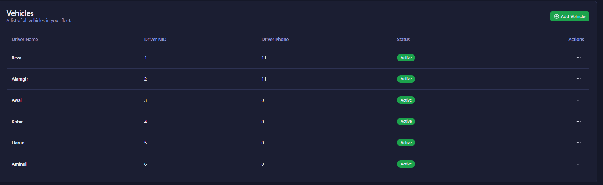
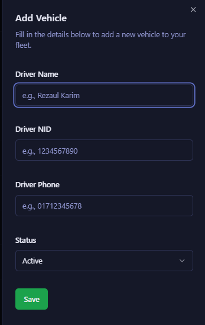

# Amar Khata

**Amar Khata** is a modern, mobile-friendly Progressive Web App (PWA) for personal and vehicle-based expense and income tracking. Built with Next.js, React, Firebase, and Tailwind CSS, it features real-time analytics, multi-language support (English & Bangla), and a beautiful, glassmorphic UI.

---

## Features

- **Authentication:** Secure email/password login and signup using Firebase Authentication.
- **Dashboard:**  
  - Quick stats: Total income, expenses, and net profit.
  - Bar and pie charts for income/expense trends and category breakdowns.
  - Top 3 income and expense categories with amounts and percentages.
  - Recent transactions table with advanced filtering (date, category, amount, search).
- **Expense & Income Logging:**  
  - Add transactions for vehicles, with custom or predefined categories.
  - Add custom categories (persisted in Firebase).
- **Vehicle Management:**  
  - Add, edit, and delete vehicles.
  - View all vehicles in a responsive table.
- **Reports:**  
  - Weekly summary of income, expenses, and profit per vehicle.
  - Export report as CSV.
- **Settings:**  
  - Update profile information (name, phone).
- **PWA:**  
  - Installable on Android, desktop, and iOS (via Safari "Add to Home Screen").
  - Offline support with service worker caching and offline banner.
- **Internationalization:**  
  - Toggle between English and Bangla.
- **Theming:**  
  - Light, dark, and system theme toggle.
- **Accessibility & Mobile UX:**  
  - Responsive design, large touch targets, and keyboard navigation.
- **Credits Footer:**  
  - Displays author info and social links.

---

## Screenshots

> _Add screenshots here for dashboard, login, mobile view, etc._
// ... existing code ...

## Screenshots

### Dashboard


### Add Transaction


### Vehicles


### Add Vehicle


### Reports


// ... existing code ...
---

## Getting Started

### 1. **Clone the Repository**

```bash
git clone https://github.com/yourusername/amar-khata.git
cd amar-khata
```

### 2. **Install Dependencies**

```bash
npm install
```

### 3. **Configure Firebase**

Create a `.env.local` file in the root with your Firebase config:

```
NEXT_PUBLIC_FIREBASE_API_KEY=your_api_key
NEXT_PUBLIC_FIREBASE_AUTH_DOMAIN=your_auth_domain
NEXT_PUBLIC_FIREBASE_DATABASE_URL=your_database_url
NEXT_PUBLIC_FIREBASE_PROJECT_ID=your_project_id
NEXT_PUBLIC_FIREBASE_STORAGE_BUCKET=your_storage_bucket
NEXT_PUBLIC_FIREBASE_MESSAGING_SENDER_ID=your_messaging_sender_id
NEXT_PUBLIC_FIREBASE_APP_ID=your_app_id
```

### 4. **Run the App**

```bash
npm run dev
```

Visit [http://localhost:9002](http://localhost:9002) (or the port shown in your terminal).

---

## PWA Installation

- **Android/Desktop:**  
  Click the "Install App" button in the header (if available), or use your browser's install prompt.
- **iOS:**  
  Open in Safari, tap the Share button, and select "Add to Home Screen".

---

## Project Structure

```
src/
  app/                # Next.js app directory (pages, layouts)
  components/         # Reusable UI and feature components
  context/            # React context providers (auth, language)
  hooks/              # Custom React hooks
  lib/                # Utilities, Firebase config, translations
  services/           # Data and API logic (Firebase)
  public/             # Static assets, manifest, service worker
```

---

## Scripts

- `npm run dev` — Start development server
- `npm run build` — Build for production
- `npm run start` — Start production server
- `npm run lint` — Lint code
- `npm run typecheck` — TypeScript type checking

---

## Technologies Used

- **Next.js** (App Router)
- **React** (18+)
- **Firebase** (Auth, Realtime Database)
- **Tailwind CSS** (with custom themes)
- **Radix UI** (accessible UI primitives)
- **Recharts** (charts and analytics)
- **Lucide React** (icons)
- **PWA** (manifest, service worker)

---

## Environment Variables

See `.env.local.example` (create this file if it doesn't exist):

```
NEXT_PUBLIC_FIREBASE_API_KEY=
NEXT_PUBLIC_FIREBASE_AUTH_DOMAIN=
NEXT_PUBLIC_FIREBASE_DATABASE_URL=
NEXT_PUBLIC_FIREBASE_PROJECT_ID=
NEXT_PUBLIC_FIREBASE_STORAGE_BUCKET=
NEXT_PUBLIC_FIREBASE_MESSAGING_SENDER_ID=
NEXT_PUBLIC_FIREBASE_APP_ID=
```

---

## Credits

Developed by **Mahir Mahmud Siam**  
[GitHub](https://github.com/MahirMsiam) | [Facebook](https://www.facebook.com/mahirmahmudsiam) | [LinkedIn](https://www.linkedin.com/in/mahir-mahmud-siam)

---

## Future Improvements

- Advanced analytics
- Push notifications (when supported)
- More accessibility features
- Monetization options

---

**_Amar Khata — Your personal and vehicle expense tracker, always with you!_** 

---

## Contributing

We welcome contributions from the community! To contribute:

1. **Fork the repository** and create your branch from `main`.
2. **Clone your fork** and install dependencies:
   ```bash
   git clone https://github.com/yourusername/amar-khata.git
   cd amar-khata
   npm install
   ```
3. **Create a new branch** for your feature or bugfix:
   ```bash
   git checkout -b my-feature
   ```
4. **Make your changes** and add tests if applicable.
5. **Run lint and type checks** before committing:
   ```bash
   npm run lint
   npm run typecheck
   ```
6. **Push your branch** and open a Pull Request (PR) with a clear description.
7. **Wait for review** and address any feedback.

### Code of Conduct

Please be respectful and constructive in all interactions. See [Contributor Covenant](https://www.contributor-covenant.org/) for guidelines.

--- 
